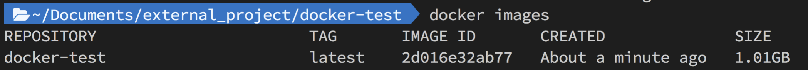
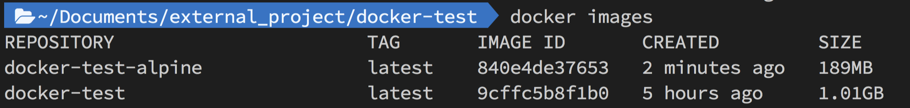
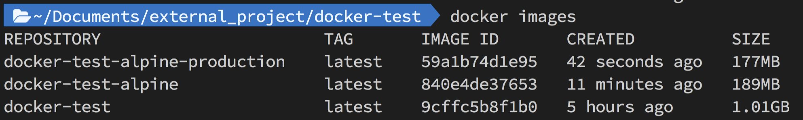
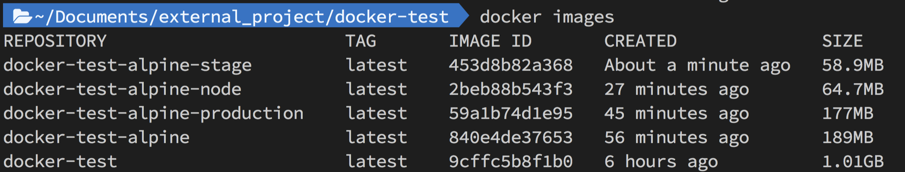
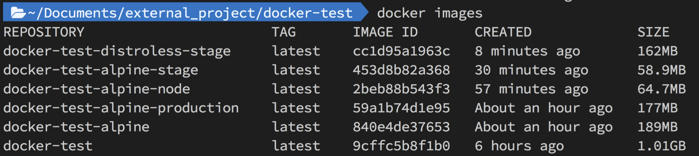
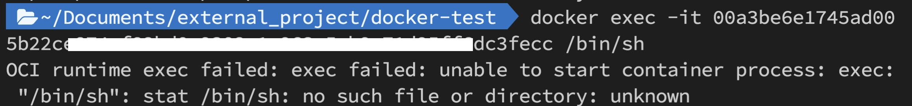

# 實測有效！手把手帶你減少 90% 的 Docker Image 體積

Docker Image 體積越大，那部署需要花的時間就越長；假如每個版本都有好幾 GB，那並不是一個理想的狀態；因此筆者開始動手實作，想看看到底能將 Docker Image 的體積縮小多少！

### ㄧ、先初始化一個簡易的 Node.js 專案

```sh
# 建立資料夾
mkdir docker-test
cd docker-test

# 初始化應用
npm init

# 安裝 express
npm install express --save
```

初始化後的 package.json 大概會長這樣（scripts 的 start 筆者有微調）：

```json
{
  "name": "docker-test",
  "version": "1.0.0",
  "description": "",
  "main": "index.js",
  "scripts": {
    "start": "node index.js"
  },
  "author": "",
  "license": "ISC",
  "dependencies": {
    "express": "^4.18.1"
  }
}
```

接著我們新增一個「index.js」的檔案，並貼上如下程式：
```js
const express = require('express')
const app = express()
const port = 3000

app.get('/', (req, res) => {
  res.send('Hello World!')
})

app.listen(port, () => {
  console.log(`Example app listening on port ${port}`)
})

```

為了實測不同情境打包的影響，我們安裝一個儲存在「devDependencies」的套件
```sh
npm install eslint -save-dev
```

### 二、撰寫 Dockefile，了解優化前體積有多大

這邊我們就先用最簡易的方式寫 Dockerfile：

```Dockerfile
FROM node

# 運行的資料夾
WORKDIR /usr/src/app

# 移動所需檔案
COPY package.json index.js ./

# 安裝套件
RUN npm install

# 提供服務的接口
EXPOSE 3000

CMD ["npm", "start"]
```

接下來輸入 `docker build -t docker-test .` 就可以建立 Docker Image（docker-test 是名稱）。

然後輸入 `docker images` ，確認剛剛建立的 Docker Image 是否存在；從下圖我們可以看到沒經過優化的 **Image 大小高達 1.01GB**。


### 三、使用 Node.js 的 Alpine 版本

Alpine 版本的 Image 體積會遠小於完整的 Node.js Image，現在我們修改一下 Dockerfile：

```Dockerfile
# 使用 Alpine 版本 
FROM node:alpine

WORKDIR /usr/src/app

COPY package.json index.js ./

RUN npm install

EXPOSE 3000

CMD ["npm", "start"]
```

輸入 `docker build -t docker-test-alpine .` 來建立 Image，完成後輸入 `docker images` 看看 build 出來的 Image 有多少差異。



從上圖我們可以看到，透過 Alpine Linux 我們讓它的體積從 1.01GB 下降到了 189MB，整整少了 812MB！

### 四、正式環境下，不需要安裝 devDependencies 的套件

通常一個專案會安裝一些 devDependencies 的套件，但這些套件只需要在開發環境中輔助使用，在正式環境下並沒有安裝的必要。

我們調整一下 Dockerfile 安裝套件的指令：

```Dockerfile
FROM node:alpine

WORKDIR /usr/src/app

COPY package.json index.js ./

# 只安裝 dependencies 的套件
RUN npm install --production

EXPOSE 3000

CMD ["npm", "start"]
```

建立好 Image 後，透過 `docker images` 我們可以看到體積又變小了，果然還有優化的空間（少了 12MB）。



### 五、如果我們只使用最基礎的 Alpine，然後 Node.js 自己安裝呢？

剛剛我們使用的是 Node.js 的 Alpine 版本，如果更極端一點，只使用最基礎的 Alpine，然後自己額外安裝 Node.js 會有什麼樣的結果呢？

```Dockerfile
# 使用最基礎的 Alpine
FROM alpine:latest

# 自己安裝 Node.js & npm
RUN apk add --no-cache --update nodejs npm

WORKDIR /usr/src/app

COPY package.json index.js ./

RUN npm install --production

EXPOSE 3000

CMD ["npm", "start"]
```

沒想到這個操作又把整包 Image 的體積壓的更低了（從 177MB 降到 64.7MB）。


### 六、採用多階段構建，取用上個階段產生的結果

Docker Image 你可以先想想成疊疊樂，在這之中多執行一次「RUN」就會多疊一層；而在 Docker 的世界中可以允許有多個「FROM」，但只會取用最後一個「FROM」所建立的 Image。

在了解上面的概念後，我們就可以把「安裝」的步驟放在第一個「FROM」裡面執行，然後第二個 FROM 就只是單純地把第一層安裝好的結果搬過去即可，用 Dockerfile 實現會長這樣：

```Dockerfile
FROM alpine:latest AS builder
RUN apk add --no-cache --update nodejs npm
WORKDIR /usr/src/app
COPY package.json index.js ./
# 先完成安裝
RUN npm install --production

FROM alpine:latest
RUN apk add --no-cache --update nodejs npm
WORKDIR /usr/src/app
# 把安裝好的全部移過去
COPY --from=builder /usr/src/app .
EXPOSE 3000
CMD ["npm", "start"]
```

經過這麼多的努力後，我們的 Docker Image 也順利從 1.01GB 下降到 58.9MB，減少了超過 94% 的體積，並且可以明顯感受到 build Image 的速度上升不少。



### 七、使用 distroless 讓正式環境更加安全

儘管上面我們已經使用 alpine 讓 Docker Image 變得這麼小，但在文章的最後我想再提供給讀者一個選擇，
那就是「distroless」！

先讓我們用它來 Build 一個 Docker Image。

```Dockerfile
FROM node AS builder
WORKDIR /usr/src/app
COPY package.json index.js ./
RUN npm install --production

# 改成用 distroless
FROM gcr.io/distroless/nodejs
WORKDIR /usr/src/app
COPY --from=builder /usr/src/app .
EXPOSE 3000
CMD ["index.js"]
```



如果單純從結果來看，它在體積上並沒有什麼優勢，但如果你嘗試用 Shell 打開它，會發現 Shell 根本不存在！換而言之，它的安全性相對更高，可以考慮使用它來做正式環境的部署。



> 小弟對 Docker 的熟悉度較低，如果文中有表達不清晰、錯誤的部分再煩請告知，感謝您的閱讀。

**參考資源**：[Node.js docker 鏡像體積優化實踐](https://cnodejs.org/topic/5cada94fdad66d658e40782c)、[三個技巧，將Docker鏡像體積減小90%](https://www.techug.com/post/3-simple-tricks-for-smaller-docker-images/)